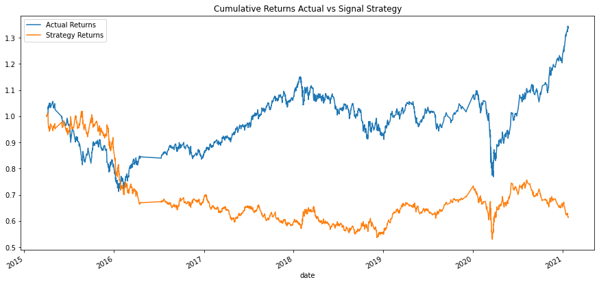
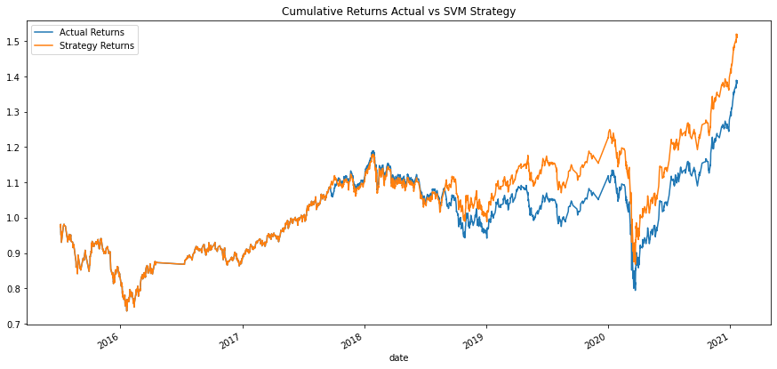
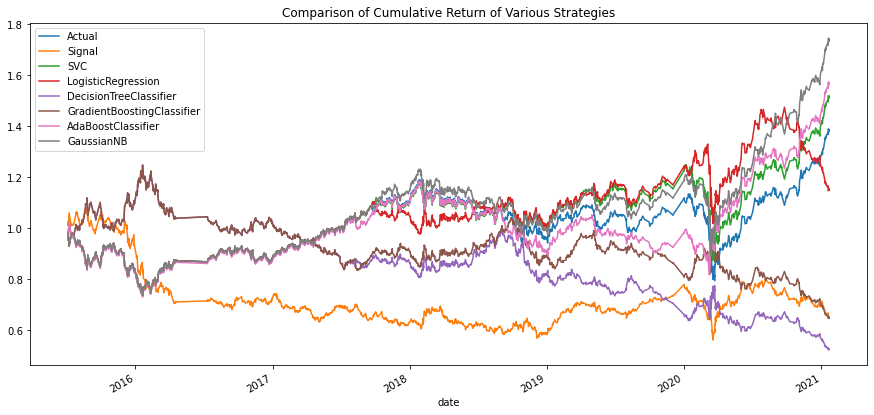
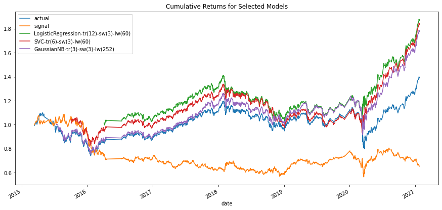
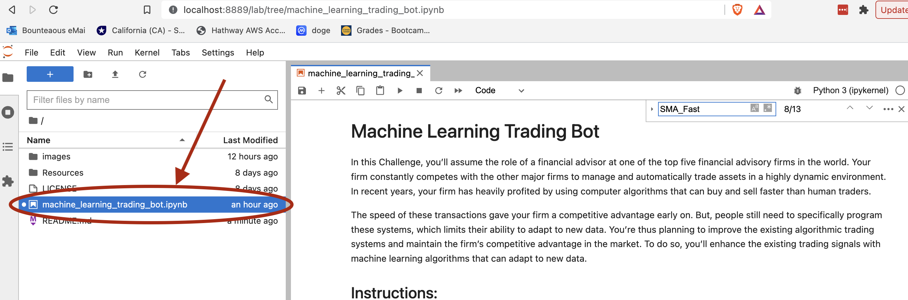

# iWarren

iWarren is an an algorithmic trading bot that leverages algorithmic trading and machine learning models to enhance returns by actively trading the *iShares Currency Hedged MSCI Emerging Markets ETF*.

---

## Overview of the Analysis
In this analysis, several automated trading techniques are evaluated to optimize the return of trading *iShares Currency Hedged MSCI Emerging Markets ETF*. 

### Data Preparation
Historical *iShares Currency Hedged MSCI Emerging Markets ETF* OHLCV data spanning from 2015-01-15 through 2021-01-22 was obtained and read into a dataframe.

### Algorithmic Trading Approach
The algorithmic trading approach was based on prior day returns. A trading signal was developed using the following: 

1. The **close** data was used to calculate the daily **percent change**
1. When the daily **percent change** >= 0, the signal was given a value of 1
1. When the daily **percent change** < 0, the signal was given a value of -1

To calculate the **strategy return** for this strategy, the signal was shifted by 1 and was multiplied by the daily **percent change**.

To evaluate the effectiveness of this trading algorithm, the cumulative return was calculated and plotted and compared to the fund's actual cumulative return.

### Machine Learning Approach
Machine learning algorithms were evaluated to assess whether they could provide suprerior results. 

#### Feature Engineering
The following data features were engineered:
* **Fast SMA**  - a Simple Moving Average (SMA) that averaged the close price for a small window, initially around 4 days.
* **Slow SMA**  - a Simple Moving Average (SMA) that averaged the close price for a large window, initially around 100 days.

#### Classification
The **signal** above was used as the classification:
* **1** indicating that the daily return was >= 0
* **-1** indicating that the daily return was < 0

#### Data Preparation
* **StandardScaler** was used to normalize the data features used to train the machine learning models.
* **training / testing datasets** were produced by subsetting the historical data.  An initial number of months of data were used to create the training dataset.  The subsequent data in the dataset was used to assessing the effectiveness of the models and for backtesting the performance of the machine learning algorithms.

#### Machine Learning Model Development and Evaluation
Various Models were assessed in the following manner:
* A classification model was selected from the sklearn toolkit, e.g. SVC
* The model was fit to the scaled training data (X_train_scaled) and the classification labels (y)
* predictions were then produced using the trained model and the test data (X_test_scaled)
* The effectiveness of the model was assessed using the following:
    * **Classification Report** was used to obtain key model metrics, such as recall, precision and F1 score, using the actual labels (y_test) and the model predictions
    * **Backtesting** was used to calculate the cumulative return of the model strategy.  These were plotted and compared with the fund's actual cumulative returns

#### Model Tuning / Optimization

In order to optimize the effectiveness of the machine learning models, multiple permutations of the key parameters were evaluated:
* **Training Dataset Size**: Machine learning models were trained using the earliest 3, 6, 12, and 18 months of *iShares Currency Hedged MSCI Emerging Markets ETF* data.
* **Fast SMA**: the fast SMA window was calculated averaging 3, 4, and 6 days.
* **Slow SMA**: the slow SMA window was calculated averaging 60, 100, and 252 days.
* **classification model**: Multiple classification models were assessed:
    * **SVC**: Support Vector Classification from sklearn's Support Vector Machines library
    * **LogisticRegression**: Logistic Regression from sklearn's linear library
    * **AdaBoostClassifier**: Ada Boost Classifier from sklearn's Ensemble library
    * **GradientBoostingClassifier**: Gradient Tree Boosting Classifier rom sklearn's Ensemble library
    * **DecisionTreeClassifier**: Decision Tree Classification from sklearn's tree library
    * **GaussianNB**:  Gaussian Naive Bayes Classification from sklearn's naive_bayes library
    * **BernoulliNB**: Bernoulli Naive Bayes Classification from sklearn's naive_bayes library

## Results

### Algorithmic Trading Results
The rather simple trading algorithm of buying if the close price is equal to or greater than the prior day's close price and selling is the close price is less than the prior day close price did not perform well.  It had a cumulative return of 61.4%, indicating that this strategy would have lost nearly 40%.  By contrast, the cumulative return of *iShares Currency Hedged MSCI Emerging Markets ETF* of was 134%, indicating that simply buying and holding the fund returned about 34%, almost 75% better than the trading algorithm.

### Initial SVC Model Results
The initial SVC model with a 3 month training dataset, 4 day Fast SMA, 100 day Slow SMA, did better.  It had a cumulative return of 152%, which beat the funds actual cumulative return of 134% by almost 20%.

### SVC Model Tuning Results
Several tuning permutations were created by varying training dataset size, fast SMA and slow SMA as described above.  

-sw(3)-lw(60)_returns.png)

After reviewing the results of the various permutations, it was found that the best result for the SVC model was obtained when using the following settings:

* 6 months of training data
* a fast window of 3 days
* a slow window of 60 days

### Machine Learning Classifier Results
A number of machine learning classifiers were evaluated as desdcribed above using the original settings: 3 months of training data, 4 day fast SMA, 100 day slow SMA.

It was found that of the classifiers that were evaluated, 3 returned better results than the fund's cumulative results.  These were:
* GaussianNB
* ADABoostClassifier
* SVC

### Tuning Learning Classifier Results
The above models were then tuned using the above permutations, resulting in a total of 216 model permutations that were compared with the algorithmic trading approach and the fund's actual return.

Several Obesrvations were made:
* Several models consistently yielded better returns than the fund's actual returns
* Tree clasifiers tended to not perform well.
* For most classifiers, the amount of training data had more impact than changes in the fast SMA and slow SMA
* Several classifiers consistently exceeded the actual fund returns

The top three of all of the permutations were:

|  classifier | training months | fast SMA | slow SMA | Cumulative Return |
|-------------|-----------------|----------|----------|-------------------|
|  LogisticRegression | 12 | 3 | 60 | 188% |
|  SVC | 6 | 3 | 60 | 184% |
|  GaussianNB | 3 | 3 | 252 | 178% |

## Summary

 The *iShares Currency Hedged MSCI Emerging Markets ETF* yielded a cumulative return of 134%.  The algorithmic trading approach evaluated performed much worse than the fund. 
 
 In contrast, several machine learning classifiers consistently provided better returns than the fund's actual return, indicating that actively trading the fund using a machine learning classifier can enhance returns, potentially providing approximately 50% better returns than the fund's actual returns.

---

## Technologies

* **Pandas**  - A python library with advanced financial analysis tools.
* **NumPy** - A python library providing that provides advanced computing tools for fast operations on arrays, including mathematical, logical, shape manipulation, sorting, linear algebra, statistical operationother functions.
* **Jupyter Lab** - An IDE used for visualization.
* **anaconda** - A python framework consisting of several tools used in financial analysis, such as Pandas and Jupyter Lab.
* **hvplot** - A set of Python visualization tools used to create compelling, and interactive visualizations.
* **sklearn** - An open-source Python library offers algorithms and models for building machine models.

---

## Usage
Once Jupyter Lab has started in your browser, select the **machine_learning_trading_bot.ipynb** notebook from the **Left Sidebar**.  This is the main analytical notebook.

---

## Contributors

*  **Martin Smith** &nbsp;&nbsp; |
&nbsp;&nbsp; *email:* msmith92663@gmail.com &nbsp;&nbsp;|
&nbsp;&nbsp; 

---

## License

